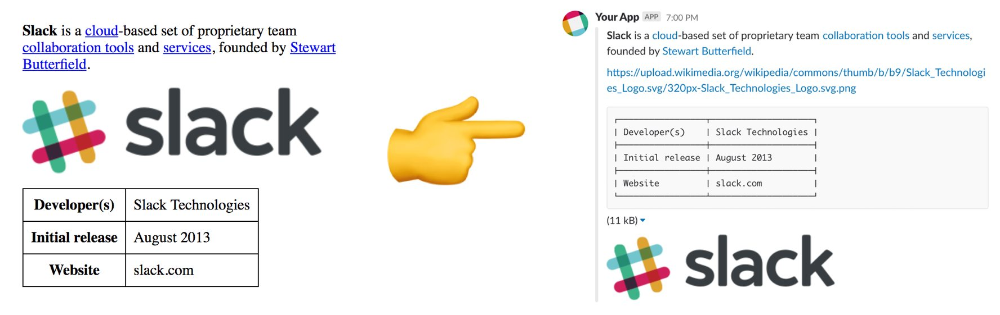

# html-to-mrkdwn [](https://github.com/namoscato/html-to-mrkdwn/actions)

Convert HTML to Slack's [mrkdwn](https://api.slack.com/docs/message-formatting) format.



## Usage

```js
const mrkdwn = require('amo-html-to-mrkdwn')

const html = `
<p><strong>Hello</strong> <a href="https://example.com">cruel</a> <em>world</em>!</p>

<p></p>
`

mrkdwn(html)
```

```json
{
  "text": "*Hello* <https://example.com|cruel> _world_!\n\n<https://media.giphy.com/media/5xtDarEbygs3Pu7p3jO/giphy.gif>",
  "image": "https://media.giphy.com/media/5xtDarEbygs3Pu7p3jO/giphy.gif",
}
```

## Parameters

The module exports a function that takes the following parameters:

| Parameter | Type | Description |
| --- | --- | --- |
| `html` | `string` | Required HTML string |
| `flavor` | `string` | Optional application-specific HTML flavor |
| `options` | `object` | Optional flavor options |

## Flavors

Application-specific HTML flavors are supported by including an optional second argument. Supported flavors include:

### `github`

per [GitHub Flavored Markdown](https://github.github.com/gfm/)

### `jira`

per [rendered Jira comments](https://developer.atlassian.com/cloud/jira/platform/rest/#span-class-parameter-name-expand-span-15)

#### Options

| Option | Type | Example | Description |
| --- | --- | --- | --- |
| `jiraBaseUrl` | `string` | `https://subdomain.atlassian.com` | Jira base URL used to generate absolute attachment links |
